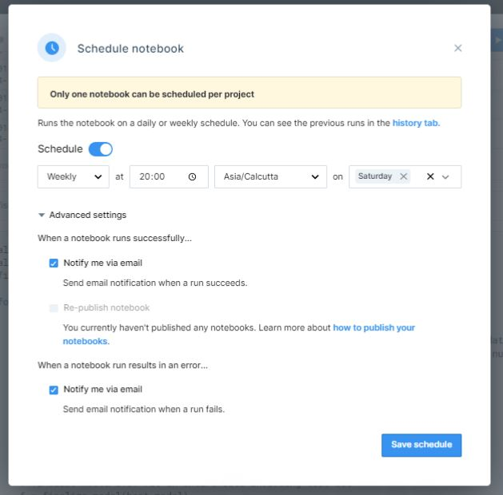
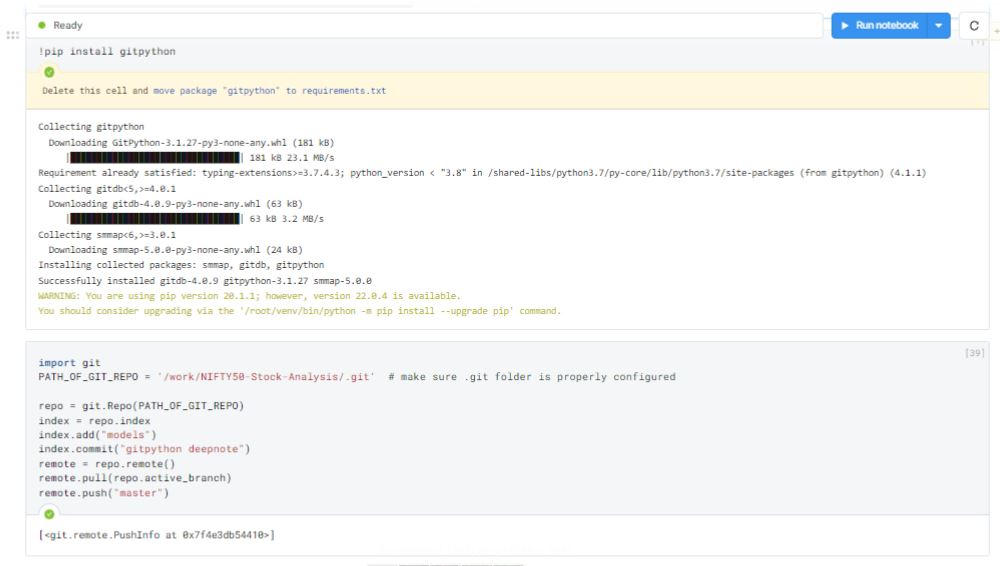
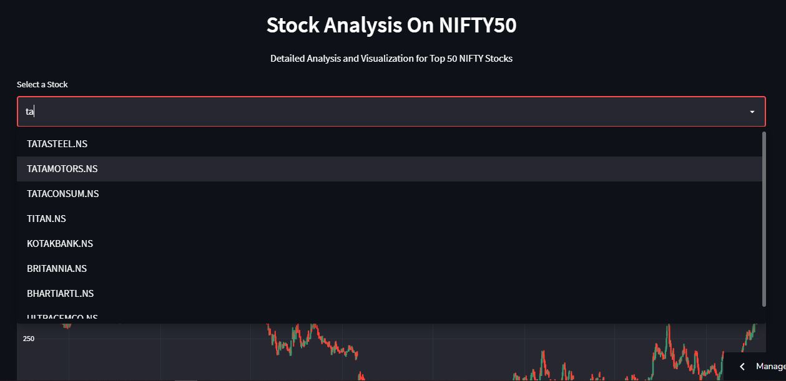
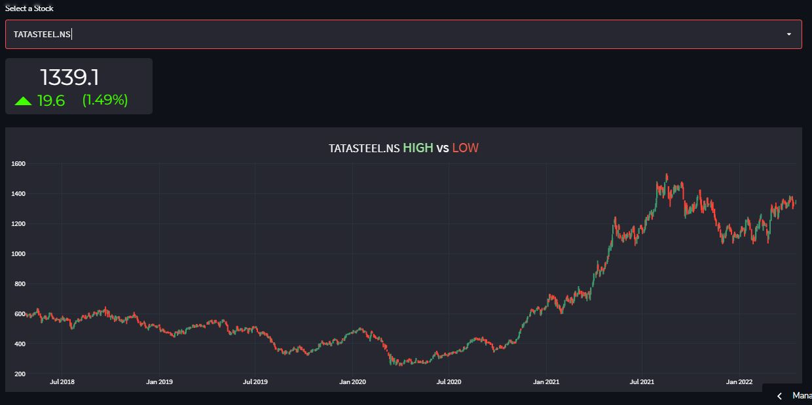
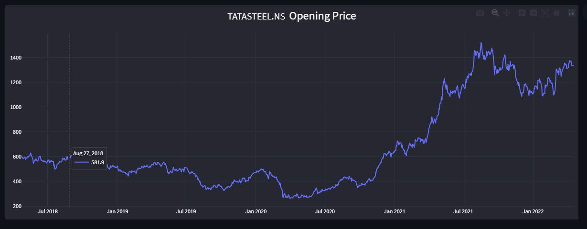
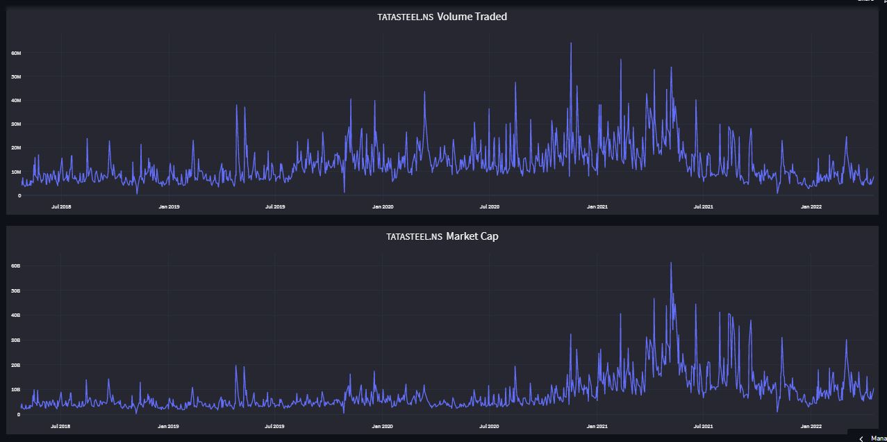
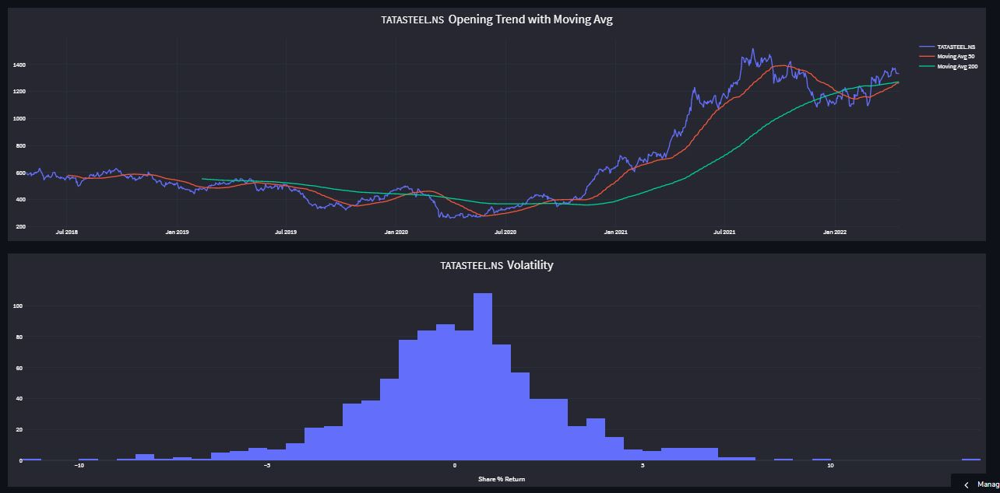
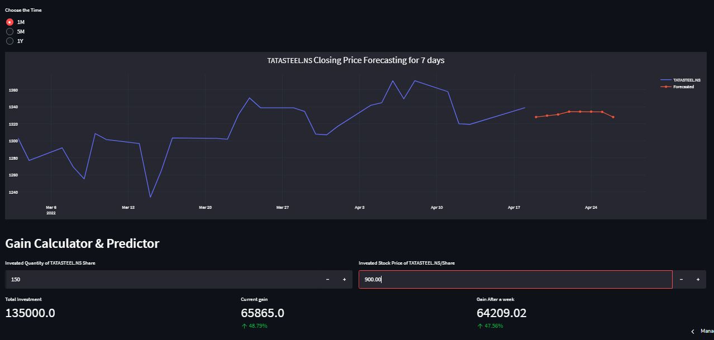

# Build with
[](https://www.python.org/downloads/release/python-380/)


[](https://www.linkedin.com/posts/hitesh-chaudhari-0259ba14a_data-finance-future-activity-6922206446352760832-8Stb?utm_source=linkedin_share&utm_medium=member_desktop_web)

# NIFTY50  Stocks Analysis, Visualization, Forecasting and Gain Calculation & Prediction.

A web App deployed on Streamlit Cloud that Analyse and Visualize the stock Data collected from the NIFTY50 stock's and then Forecasts the stock price for next 7 days, for every individual stock and also show the Gain Calculation & Prediction of the stock.

Watch a short App flow video here 👇.

https://user-images.githubusercontent.com/72800256/163971875-ab68c45d-5069-4dc2-8a96-b56f68d61014.mov

You can try out this app [here.](https://share.streamlit.io/hitman-dev/nifty50_stock-analysis/app.py)

## What is a Stock market?

The stock market is a marketplace that allows for the seamless exchange of corporate stock purchases and sales. Every Stock Exchange has its own value for the Stock Index. The index is the average value derived by adding up the prices of various equities. This aids in the representation of the entire stock market as well as the forecasting of market movement over time. The stock market can have a significant impact on individuals and the economy as a whole. As a result, effectively predicting stock trends can reduce the risk of loss while increasing profit

## Machine learning in stock market
 
Stock and financial markets tend to be unpredictable and even illogical. Due to these characteristics, financial data should be necessarily possessing a rather turbulent structure which often makes it hard to find reliable patterns. Modeling turbulent structures requires machine learning algorithms capable of finding hidden structures within the data and predict how they will affect them in the future. The most efficient methodology to achieve this is Machine Learning and Deep Learning. Deep learning can deal with complex structures easily and extract relationships that further increase the accuracy of the generated results.

Machine learning has the potential to ease the whole process by analyzing large chunks of data, spotting significant patterns and generating a single output that navigates traders towards a particular decision based on predicted asset prices.

## Project overview
In this project we have collected the Historical data of NIFTY 50 stocks by using yfinance  API, then applied Forecasting model for each stock individually and than Forecasted the stock price for next 7 days. we have also included a GAIN calculator and GAIN predictor according to current price and next 7 days gain.

## API Used

- Yahoo! Finance's API to download the historical data for NIFTY 50 stock.
  - API link :- 'https://pypi.org/project/yfinance/'

## Model training and dynamic updation on github
All the models related to stocks were trained on a scheduled notebook on a weekly basis. These models were trained on the [Deepnote](https://deepnote.com/) and the final models were pushed to the Github repository with the help of [GitPython ](https://gitpython.readthedocs.io/en/stable/tutorial.html) library. Thus we will always get updated models every week.

All this was done to save the resources on the streamlit server side. 

### Scheduling deepnote notebook 👇.


### Auto Commit to github using GitPython 👇.

Code for Auto commit to Github.
```python
import git
PATH_OF_GIT_REPO = '/work/NIFTY50-Stock-Analysis/.git'  # make sure .git folder is properly configured

repo = git.Repo(PATH_OF_GIT_REPO)
index = repo.index
index.add("models")
index.commit("gitpython deepnote")
remote = repo.remote()
remote.pull(repo.active_branch)
remote.push("master")
```


 
## Stock price Forecasting

For forecasting we have used various algorithms and auto ML libraries but the best out was given by Pycaret auto ML library.
PyCaret is an Auto-ML library used for the building machine learning models. PyCaret is an open-source, low-code machine learning library in Python that automates machine learning workflows.It is an end-to-end machine learning and model management tool that exponentially speeds up the
experiment cycle and makes you more productive.
You can get more information about PyCaret [here.](https://pycaret.org/)

So by using PyCaret Forecasting Algorithm, we made individual models for each stock(total 50 ML models) which are loaded dynamically and gives the respective stock price forecasting for next 7 days.

Code for Forecasting model
```python
from pycaret.regression import *

all_ts = data['stock_name'].unique()
all_results = []
final_model = {}

for i in all_ts:
    df_subset = data[data['stock_name'] == i]
    # initialize setup from pycaret.regression
    s = setup(df_subset, target = 'Close', train_size = 0.95, transform_target = True, data_split_shuffle = False,
            fold_strategy = 'timeseries', fold = 5, ignore_features = ['stock_name'], numeric_features = ['day_of_year', 'year','month', 'day_of_week'],
            silent = True, verbose = False, session_id = 2022)
    # compare all models and select best one based on MAE
    best_model = compare_models(sort = 'MAE', verbose=True)
    
    # capture the compare result grid and store best model in list
    p = pull().iloc[0:1]
    p['stock_name'] = str(i)
    all_results.append(p)
    
    # finalize model i.e. fit on entire data including test set
    f = finalize_model(best_model)
    
    # attach final model to a dictionary
    final_model[i] = f
    
    # save transformation pipeline and model as pickle file 
    save_model(f, model_name='/NIFTY50-Stock-Analysis/models/' + str(i), verbose=False)
```
The Data Processing for Forecasting modeling and saving the individual stock model is shown in this [notebook.](https://github.com/hitman-dev/NIFTY50_Stock-Analysis/blob/master/stock_model_save.ipynb)

The models are then loaded dynamically for forecasting of stock price for each individual stock.

Code for Gain calculation.
```python
investment = round((quantity * stock_price), 2)
current_price = round((closing_price * quantity), 2)
current_gain = current_price - investment
current_gain_percent = round((current_gain / investment * 100), 2)

price_after_week = round((quantity * final_forecast["Label"].iloc[-1]), 2)
gain_after_week = round((price_after_week - investment), 2)
gain_after_week_percent = round((gain_after_week / investment * 100), 2)
```

# Flow of Application
### Selection of Input
The app assists in selection of Stock for which you want Analysis ,Visualization ,Forecasting and Gain calculation & prediction.


### Current Stock related information with history data visualization
 The app shows a small info card that shows Current stock price with gain amount, percentage gain and gain indicator. The gain can be positive gain or negative gain. It also shows the history data candlestick plot the shows High vs Low for the respective stock till current date.


### Opening price plot 
 The app shows a Opening price plot that shows the trend and variations in the opening price of the stock till current date.


### Volume Traded and Market Cap plot 
 The app shows a Volume Traded and Market Cap plot that shows the trend and variations in the Volume Traded and Market Cap of the stock till current date.
- Volume of trade, also known as trading volume, refers to the quantity of shares or contracts that belong to a given security traded on a daily basis. In other words, trading volume provides a measure of the number of shares that are transacted between a given time period
- Market cap refers to the total value of a publicly traded company's shares. Shorthand for "market capitalization," market cap is one way an investor can evaluate how much a company is worth.


### Opening Trend with Moving Avg and Volatility plot 
 The app shows a Opening Trend with Moving Avg and Volatility plot  that shows the trend and variations in the Opening Trend with Moving Avg and Volatility of the stock till current date. 
- In finance, a moving average (MA) is a stock indicator that is commonly used in technical analysis. The reason for calculating the moving average of a stock is to help smooth out the price data by creating a constantly updated average price.
By calculating the moving average, the impacts of random, short-term fluctuations on the price of a stock over a specified time frame are mitigated.
- Volatility is the rate at which the price of a stock increases or decreases over a particular period.
Higher stock price volatility often means higher risk and helps an investor to estimate the fluctuations that may happen in the future.
 The Volatility shows how the stock performs and from which we can decide the risk factor of the stock for investment.


### Closing Price Forecasting and Gain calculation & prediction.
- The app shows a Closing Price Forecasting plot  that includes analysis of stock's closing price till current date and Forecasting for the next seven days. You can see the plot for three different scale that is for one month, for five months and for one year according the option as specified by the user.
- The app also shows Gain calculation and prediction based on the user input of number of stocks invested and stock price per share of the selected share at the time of investment. The app shows Initial total investment ,current gain amount and current precentage gain and next seven days gain amount and next seven days precentage gain ,the gain can be positive gain or negative gain.


 # Collaboration 
 This project is collaborative work of:-
 
#### Hitesh Chaudhari
[](https://www.linkedin.com/in/hitesh-chaudhari-0259ba14a/)
[](https://github.com/hitman-dev)
 
#### Siddhant Mishra
[](https://www.linkedin.com/in/siddhant-mishra-02aa50110/)
[](https://github.com/0NE-C0DEMAN)
